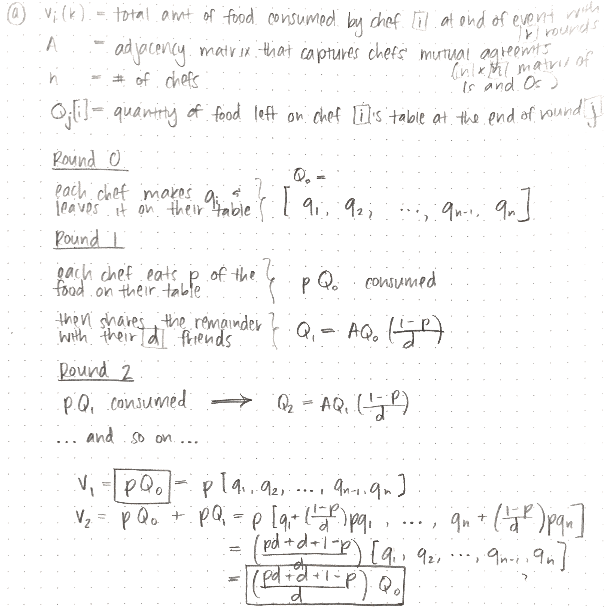
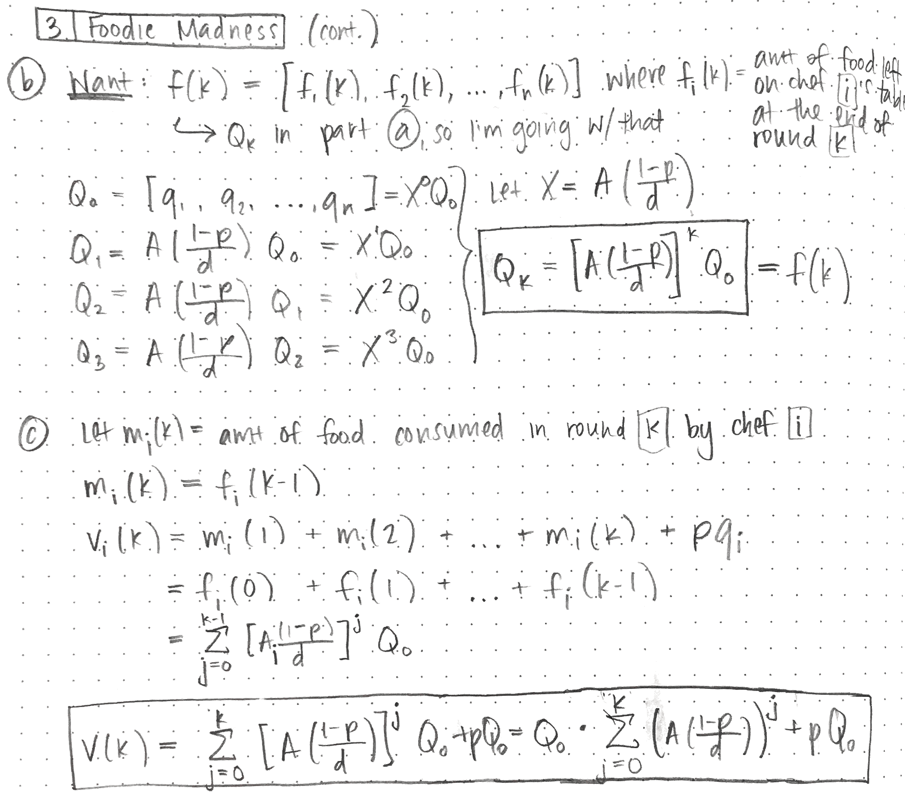
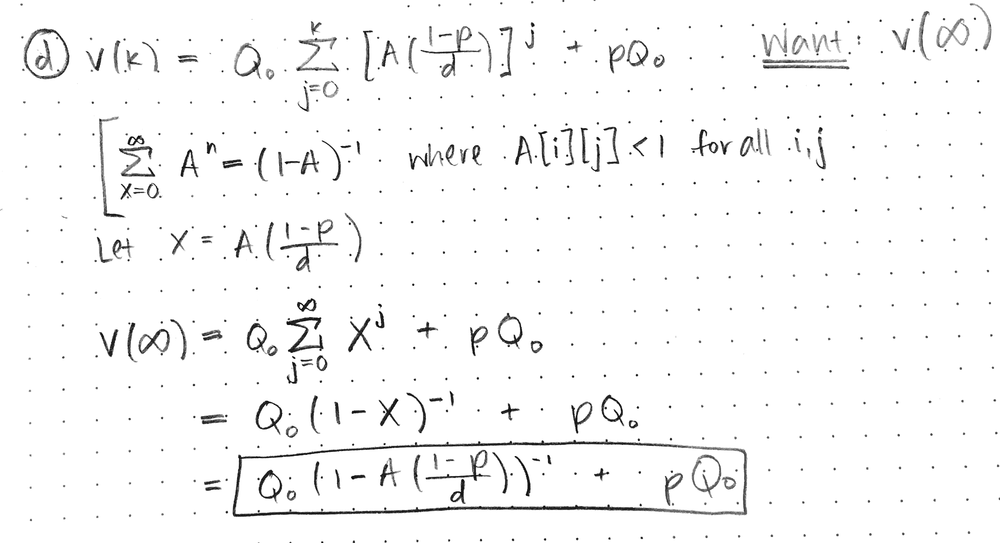

Devon Zuegel &nbsp; // &nbsp; 8 Oct 2015 &nbsp; // &nbsp; CS 224W

# Problem Set 1 #

## Problem 1 :: Network characteristics (30 points) ##

### Part A ###

> Code in `hw1p1a.py` + `myutil.py`.

### Part B ###

In any given social group, your friends are on average more popular than you are, due to a sampling bias called [The Friendship Paradox](en.wikipedia.org/wiki/Friendship_paradox). This happens because "people with more friends are more likely to be your friend in the first place; that is, they have a higher propensity to make friends in the first place" (Wikipedia).

The same is true for this node network, where a direct neighbor of any given node has a higher expected degree than it. By increasing the probability that new nodes are connected to a neighbor node rather than just any random node, we are creating the graph through **preferential attachment**.

As a result, the degrees follow a power law distribution more closely for lower values of `prob` (which corresponds to higher probabilities that new nodes connect to a random existing node `n`'s neighbor rather than `n` itself).

### Part C ###

> Code in `hw1p1c.py` + `myutil.py`.

If a large bin contains an outlier or a large number of nodes, we would expect to see a larger alpha value.

**Output from running `hw1p1a.py`:**

```py
xmin  = 1
alpha = 2.02223810403
```

These values aren't super surprising. The slope at $10^{0} = 1$ of the log graph (generated by running the code found in `hw1p1a.py`) in part a is basically $\infty$, straight straight up and down vertically, which suggests that the the minimum value is `1`.

Our $\alpha = 2.0222...$ also makes sense, since the power law reading explained that any alpha whose value is `> 1` has "bins" of increasing size but decreasing number of nodes they contain.

### Part D ###

> Code in `hw1p1d.py` + `myutil.py`.

In part a, earlier nodes tend to have a higher degree because they have more opportunities to connect to many nodes. Meanwhile, in this part we see that most nodes have approximately the same degree along a normal distribution. This is because each node is connected (on average) to 10% of the other nodes at any given time, rather than new nodes being randomly connected to any already-added nodes (which is what gave old nodes the advantage in part a).

## Problem 2 :: Who is the most central actor? (30 points) ##

### Part A ###

**20 actors with the highest degree centrality:**
```md
RANK  NAME                   DEGREE             NUM FILMS   MAIN GENRE
#1    Davis, Mark (V)        0.0449180703564    540         Adult
#2    Sanders, Alex (I)      0.0349490088232    467         Adult
#3    North, Peter (I)       0.0343187807952    460         Adult
#4    Marcus, Mr.            0.0334593789389    435         Adult
#5    Tedeschi, Tony         0.0321416294259    364         Adult
#6    Dough, Jon             0.0317978686834    300         Adult
#7    Stone, Lee (II)        0.0312249341125    403         Adult
#8    Voyeur, Vince          0.0305374126275    370         Adult
#9    Lawrence, Joel (II)    0.0286467285436    315         Adult
#10   Steele, Lexington     0.028245674344      429         Adult
#11   Ashley, Jay           0.0280737939727     309         Adult
#12   Boy, T.T.             0.0272143921164     336         Adult
#13   Jeremy, Ron           0.0269852182881     280         Adult
#14   Cannon, Chris (III)   0.0269852182881     287         Adult
#15   Bune, Tyce            0.0265268706314     267         Adult
#16   Hanks, Tom            0.0261831098889     75          Family
#17   Michaels, Sean        0.0258393491463     252         Adult
#18   Stone, Kyle           0.0257820556892     278         Adult
#19   Hardman, Dave         0.0250945342042     319         Adult
#20   Surewood, Brian       0.0245215996333     244         Adult
```

- Every actor on that list (except Tom Hanks) has been at well over 200 films. As such, they've simply worked with lots of people.
- Every actor on that list (again except for Tom Hanks) mostly stars in adult films.

### Part B ###

**20 actors with the highest betweenness centrality:**
```md
RANK  NAME                    BETWEENNESS      NUM FILMS
#1    Jeremy, Ron             9748544.2189     280
#2    Chan, Jackie (I)        4716909.32165    59
#3    Cruz, Penelope          4330663.26451    46
#4    Shahlavi, Darren        4295502.79784    16
#5    Del Rosario, Monsour    4267099.43969    20
#6    Depardieu, Gerard       4037356.14719    56
#7    Bachchan, Amitabh       2570247.12237    35
#8    Jackson, Samuel L.      2539613.88751    97
#9    Soualem, Zinedine       2368164.44674    65
#10   Del Rio, Olivia         2316387.53485    84
#11   Jaenicke, Hannes        2136980.21405    66
#12   Hayek, Salma            2117389.70142    44
#13   Pele                    2098484.5328     10
#14   Knaup, Herbert          2062584.64127    50
#15   Goldberg, Whoopi        2051621.39925    109
#16   Roth, Cecilia           2019247.01694    23
#17   Bellucci, Monica        2006220.95681    43
#18   Hanks, Tom              1977252.23099    75
#19   August, Pernilla        1937362.14452    31
#20   Kier, Udo               1919260.77495    69
```

- While the actors with high degree centrality were all extremely prolific, the actors on this list are nearly all very well-respected in multiple genres. Vertices that have a high probability to occur on a randomly chosen shortest path between two randomly chosen vertices have a high betweenness, and since these actors are all so well-respected in multiple genres it makes sense that they are a connection point for usually disparate groups.
- The actors on this list tend to be involved in dramas, which as we can see from the actor graph tend to be more spread out (as compared to the fantasy folks who are all clumped together).
- The only actors found on both lists are "Jeremy, Ron" and "Hanks, Tom".
- Betweenness centrality tends to follow a power law distribution, which is reflected even here, where we have only the top 20: the top ranked actor "Jeremy, Ron" has nearly twice the betweenness score as the #2 ranked actor "Chan, Jackie (I)". Meanwhile the #2-#6 ranked actors' scores are nearly twice that of #7-20 (and probably beyond).

### Part C ###

20 ACTORS WITH THE HIGHEST CLOSENESS CENTRALITY:

```md
RANK  NAME                    BETWEENNESS      NUM FILMS
#1    Jackson, Samuel L.       0.309265198363    97
#2    Goldberg, Whoopi         0.307760125544    109
#3    Berry, Halle             0.305904621694    63
#4    Diaz, Cameron            0.305668902471    59
#5    Hanks, Tom               0.305230575521    75
#6    Stiller, Ben             0.304719006966    66
#7    Myers, Mike (I)          0.30261104754     58
#8    Douglas, Michael (I)     0.302605801071    41
#9    Lopez, Jennifer (I)      0.301216670981    68
#10   De Niro, Robert          0.300708095722    51
#11   Willis, Bruce (I)        0.300485487036    52
#12   Cruise, Tom              0.300407910363    46
#13   Hopper, Dennis           0.299336294569    106
#14   Kidman, Nicole           0.298767545361    54
#15   Smith, Will (I)          0.298552906161    57
#16   Washington, Denzel       0.298547799463    49
#17   Travolta, John           0.298512057465    63
#18   Madonna (I)              0.298358974359    61
#19   Schwarzenegger, Arnold   0.297743129595    70
#20   Hoffman, Dustin          0.29758068641     56
```

- All of the actors on this list are "A-list celebrities". They are not as prolific as those on the first list and respected in as many different genres as the second, but they are the most famous. Thus while they don't have incredibly high degree nor do they connect disparate groups, they are highly sought after and have likely all acted alongside another performer who does have those other characteristics. They are in the center of things rather than on the fringe.
- "Hanks, Tom" is the only actor to show up on all three lists (and the intersection of the first and third), while only "Jackson, Samuel L." and "Goldberg, Whoopi" join him on both the second and third lists.


## Problem 3 :: Foodie Madness (40 points) ##

#### Notes on Matrix Multiplication & Dot Products ####


### Part A ###



### Part B, C, & D ###




### Part E ###

```py
def rank(mylist):
    indices = list(range(len(mylist)))
    indices.sort(key=lambda x: mylist[x], reverse=True)
    ranked = [0] * len(indices)
    for new_i, old_i in enumerate(indices):   ranked[old_i] = new_i + 1
    return ranked
```


Scores after `k = 1` rounds:
```
Q1       = [ 0.6, 0.55, 0.6, 0.55, 0.6, 0.45, 0.6, 0.45]
rankings = [ 1, 5, 2, 6, 3, 7, 4, 8 ]
```

... after `k = 2` rounds:
```
Q2       = [ 1.166, 1.1, 1.133, 1.1, 1.1, 1.033, 1.133, 1.033]
rankings = [ 1, 4, 2, 5, 6, 7, 3, 8 ]
```

... after `k = 3` rounds:
```
Q3       = [ 1.4388, 1.3805, 1.4166, 1.3805, 1.3833, 1.2972, 1.4055, 1.2972]
rankings = [1, 5, 2, 6, 4, 7, 3, 8]
```

... after `k = ∞` rounds:
```
Qinf     = [ 10.08, 10.01, 10.04, 10.01, 10.0, 9.95, 10.04, 9.95]
rankings = [ 1, 4, 2, 5, 6, 7, 3, 8 ] 
```


### Part F ###

- Part c changes slightly in that what `v(k)` is now the value of what was previously `v(k + 1)`.
- Part d does not change, because `∞ + x = ∞` for any finite `x`. The amount of food eaten at each consecutive round converges to `0` as `k → ∞`.


